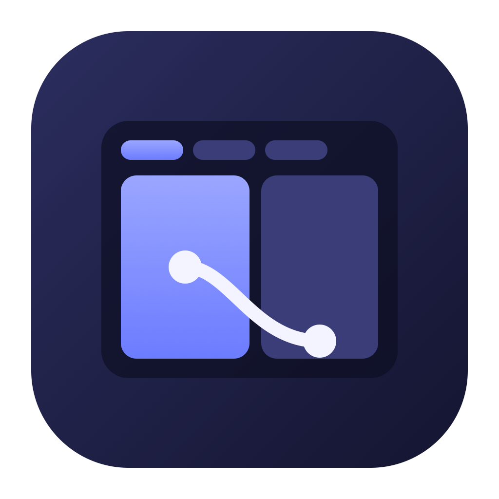

<p align="center"></p>

# Switchboard

One window, several Claude accounts. Switchboard runs the real Claude desktop
app once per profile and shows each instance in a tab, or two side by side.
Every tab is the full app, Code tab included, signed in to its own account.

Switchboard is an independent open-source tool and is not affiliated with
Anthropic. It drives the Claude desktop app you already have installed.

## How it works

Claude desktop is an Electron app and honours `--user-data-dir`. Switchboard
gives each profile its own directory (`Claude-<name>` next to the app's default
one), starts the app on it, finds the window it creates and hosts that window
in its frame.

The hosting differs by platform, and the difference is not something a wrapper
can paper over:

- **Windows** makes the guest window an *owned* window of the shell, strips
  its frame and keeps it over the shell's content area. Owned windows stay
  above their owner, follow it in the z-order and minimize with it, and the
  guest is still a top-level window, which Chromium needs before it accepts
  keyboard input. (Reparenting it as a child looked tidier and silently ate
  every key press.)
- **macOS** has no supported way to put another process's window inside yours.
  Switchboard pins the active guest window over its content area with the
  Accessibility API, hides the others, and re-pins on every move and resize.
  It looks and behaves like a tab, but it is a separate window, so it needs
  the Accessibility grant and can lag a frame during a fast drag.

Native calls go through [koffi](https://koffi.dev), so there is nothing to
compile and one codebase ships for both platforms.

## Requirements

- The Claude desktop app installed in its default place (`/Applications` on
  macOS, the MSIX package or the Squirrel install on Windows). Set
  `CLAUDE_DESK_APP` to the executable to override.
- macOS: Accessibility access for Switchboard. The app prompts for it; during
  development the grant goes to Electron itself.

## Use

Node 20 or 22. Newer npm versions may skip Electron's install script; if
`node_modules/electron/dist` is missing afterwards, run
`node node_modules/electron/install.js`.

```bash
npm install
npm start
```

Press `+`, type a profile name, and the app starts on a fresh directory with
Claude's sign-in screen. Double-click or right-click a tab to rename it; the
directory on disk keeps its original name. **Split** shows two profiles side
by side: the most recently used other tab fills the second half, and clicking
a tab afterwards replaces the half that is not focused.

Shortcuts, active only while Switchboard or one of its instances is in front:

| Keys | Action |
| --- | --- |
| Ctrl+1 … Ctrl+9 | Switch to tab 1 … 9 and give it the keyboard |
| Ctrl+Tab / Ctrl+Shift+Tab | Next / previous tab |
| Ctrl+Alt+Left / Right | Focus the left / right pane in split layout |

Sign-in works per tab. While Switchboard runs it owns the `claude://` scheme
(and re-claims it whenever a freshly started instance grabs it back), so on
macOS each instance uses an in-process auth session whose callback cannot go
astray, and on Windows the callback reaches Switchboard, which hands it to the
focused instance. The previous handler is restored on quit.

A profile made by hand (or by the `claude-profile` script) is picked up if its
directory already exists. An instance that is already running on a profile is
adopted rather than duplicated.

## Development

```bash
npm install
npm start          # not `npx electron .`: npx renames the process
```

On macOS, run this once so the dev build carries its own name and can claim
the sign-in scheme. It edits and re-signs the Electron binary inside
`node_modules`, and packaged builds need none of it.

```bash
./scripts/dev-mac-setup.sh
```

Without it the Dock, the menu bar and the about panel say "Electron", and
`claude://` links go to the Claude app instead of Switchboard.

## Icon

`build/icon.png` is rendered from `build/icon.svg`:

```bash
./scripts/build-icon.sh
```

It needs `rsvg-convert` (`brew install librsvg`). Render it with a transparent
background; a converter that flattens it leaves a white square behind the
rounded corners in the Dock and the taskbar.

## Package

```bash
npm run dist
```

Produces a DMG on macOS and an NSIS installer on Windows under `release/`.

On Windows the first build unpacks electron-builder's code-signing tools,
which contain macOS symlinks. Creating those needs a privilege a normal
account lacks, and the build fails with "A required privilege is not held by
the client". Turn on Developer Mode in Windows settings, or run the build once
from an elevated shell.

## Limits

- Closing Switchboard leaves the instances running as ordinary Claude
  windows. The next launch adopts them again. Use a tab's × to quit one.
- Anthropic's updater still runs inside each instance. After an update the app
  relaunches itself; Switchboard follows the new process.
- The shared `~/.claude` directory (settings, memory, session history) is
  common to all profiles. Only the sign-in differs.
- On macOS the Dock shows one Claude icon per instance, as the OS sees them.
  On Windows the instances have no taskbar buttons of their own, but the
  taskbar thumbnail shows an empty Switchboard frame, because the instances
  are separate windows that Windows does not composite into it.
